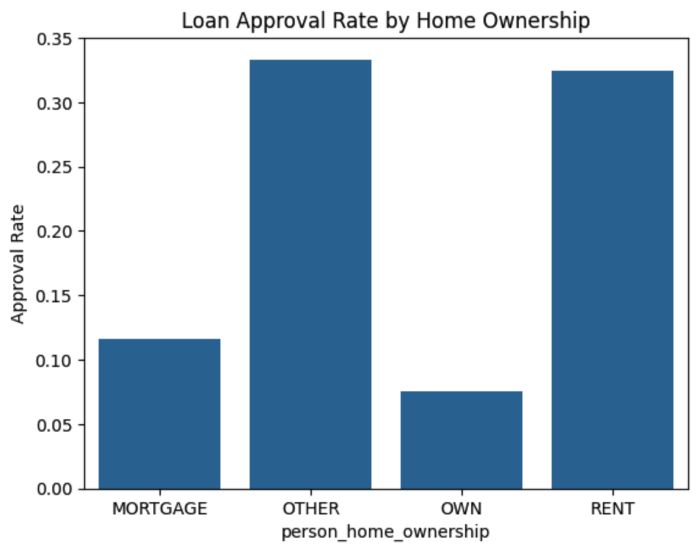
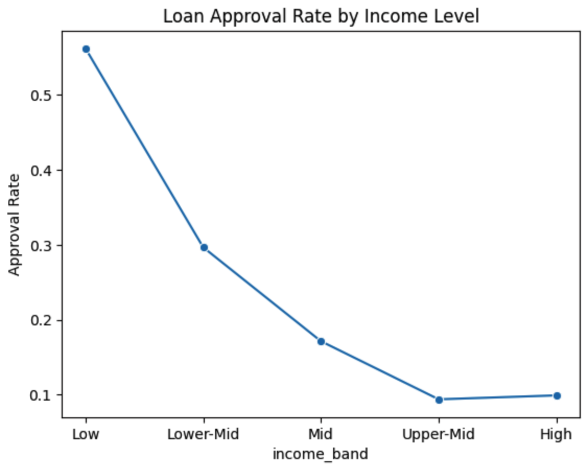
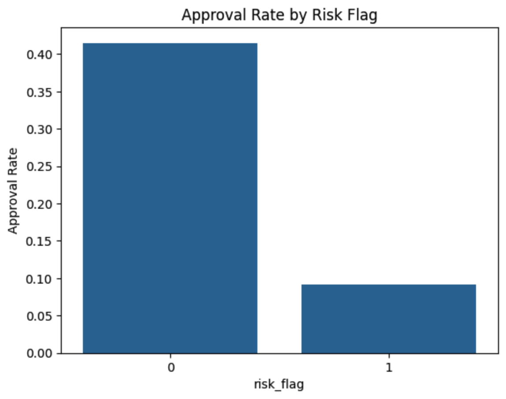

# Credit Approval Compliance & Fair Lending Risk Analysis

- Dataset: [Loan Approval Classification Dataset](https://www.kaggle.com/datasets/taweilo/loan-approval-classification-data)  
- Notebook: credit-compliance-fair-lending.ipynb

---

## 1. Background and Overview

In modern banking, credit approval decisions must balance two critical objectives: regulatory compliance and risk management.

Banks are required to:

* Ensure no discriminatory bias in lending decisions
* Align approvals with measurable financial risk
* Maintain transparency and accountability in credit policies

This project evaluates whether loan approvals are driven by borrower risk profiles or influenced by structural patterns that may introduce unfair bias.

Key business questions:

* Are approval decisions aligned with financial risk indicators?
* Do non-financial attributes (e.g., home ownership, income level) influence outcomes?
* Which segments represent the highest credit risk?
* How can lending policies be improved for fairness and compliance?

---

## 2. Data Structure Overview

The dataset contains 45,000 loan applications with 14 features.

Key Dimensions:

* Applicant Profile: Age, Gender, Education, Home Ownership
* Financial Capacity: Income, Employment Experience
* Loan Characteristics: Loan Amount, Interest Rate, Loan-to-Income Ratio
* Credit Profile: Credit Score, Credit History Length, Previous Defaults
* Target Variable: Loan Status (1 = Approved, 0 = Rejected)

Derived Metrics:

* Income Band: Segmented borrower income levels
* Risk Flag: High-risk indicator based on:
    * Credit score < 600
    * Loan-to-income ratio > 50%
    * Previous loan default

---

## 3. Executive Summary

This analysis highlights three key findings:

1. **Risk-Based Approval is Clearly Implemented:** Approval rates drop significantly for high-risk applicants, indicating strong alignment with financial risk principles.
2. **Structural Anomalies in Income & Home Ownership:** Certain non-risk variables exhibit counterintuitive patterns, suggesting potential hidden policy effects.
3. **No Direct Evidence of Demographic Bias:** Approval rates are broadly consistent across demographic groups, but indirect bias risk remains possible.

---

## 4. Insights Deep Dive

### Home Ownership vs Approval

  

Insight:

Applicants in Rent and Other categories show the highest approval rates, while homeowners and mortgage holders experience significantly lower approvals, reversing typical financial expectations.

Implication:

This suggests home ownership may not act as a pure stability signal, but rather interacts with hidden constraints such as debt burden or loan exposure, creating potential proxy-driven bias in decision rules.

### Income Level vs Approval

  

Insight:

Approval rates decline as income increases, with low-income applicants receiving the highest approvals and high-income applicants the lowest.

Implication:

This counterintuitive pattern indicates that loan structure (e.g., larger loan sizes or stricter thresholds) may be disproportionately limiting higher-income applicants, pointing to potential inefficiencies or unintended bias in policy design.

### Risk Profiling (High-Risk Segments)

  

Insight:

Low-risk applicants achieve substantially higher approval rates, while high-risk applicants are consistently filtered out.

Implication:

This demonstrates that the approval system is strongly anchored in financial risk assessment, confirming that core decisions are driven by repayment capacity rather than demographic attributes.

## 5. Recommendations
* **Strengthen Risk-Based Decisioning:** Continue prioritizing financial indicators such as credit score, repayment burden, and default history as the primary drivers of approval decisions.
* **Audit Structural Bias in Policies:** Reassess rules related to home ownership and high-income applicants to ensure they are not acting as indirect proxies for unfair treatment.
* **Enhance Decision Transparency:** Implement explainable models to clearly justify approval outcomes under regulatory scrutiny.
* **Refine Credit Policy Thresholds:** Re-evaluate constraints on large or high-income loans to ensure alignment with actual risk rather than rigid rules.
* **Establish Continuous Fair Lending Monitoring:** Track approval patterns across segments to detect and mitigate emerging bias risks proactively.
